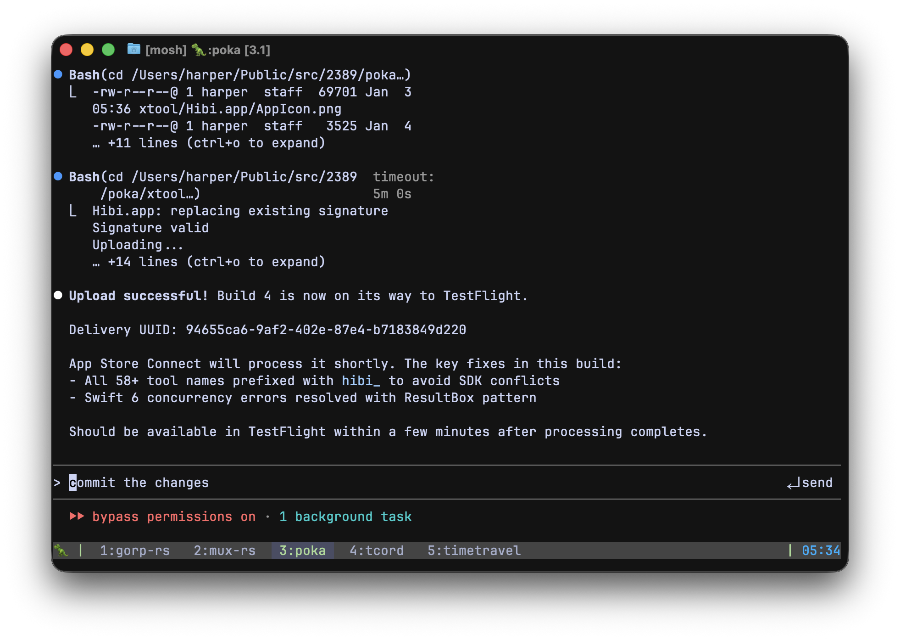
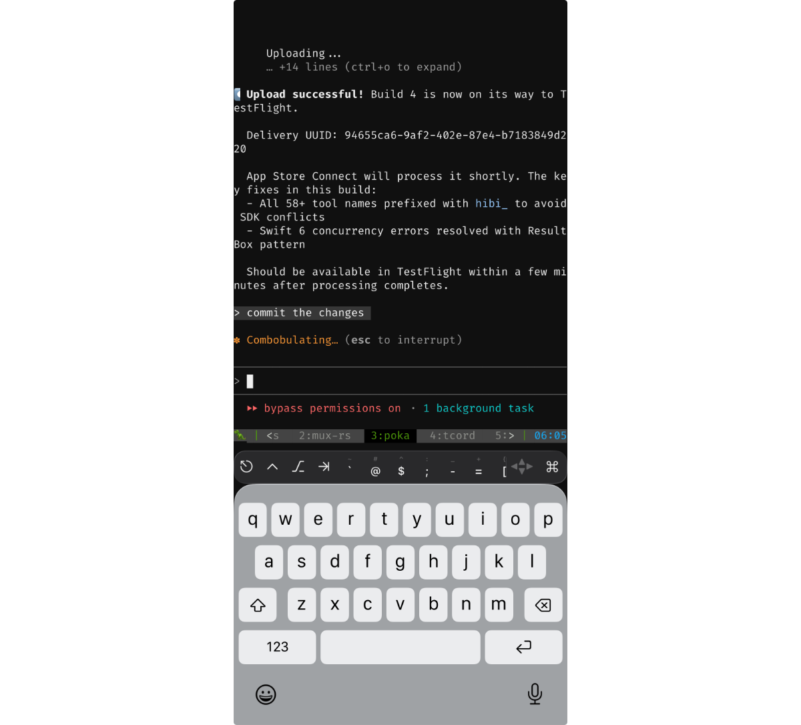
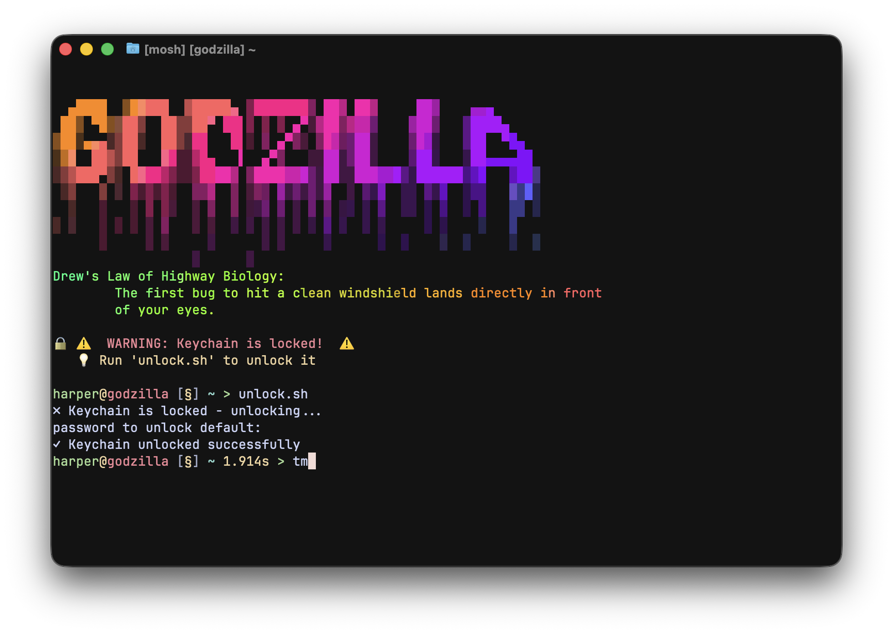

とにかく本当にたくさんの友だちから「どうやってスマホで Claude Code を動かしてるの？」と聞かれる。毎回ちょっと驚くんだけど、こういう作業はもう 25 年（いや、もっと？）くらい続けているので、今となっては半ば“失われたアート”になっていることを忘れがちなんだ。昔はこうだった。洒落た IDE や “ワンクリックでデプロイ” なんて魔法はなく、マシンに SSH（つか、Telnet！）で入り、ターミナルとにらめっこしていた。最高だった。完全な悪夢でもあった。そしてとにかく楽しかった。

> 2000 年代前半でいちばん好きだったのは、IRC チャンネルでだらだら過ごしながら、とびきりイカれたテック系コミュニティに混ざってた時間だ。ほんと最高だった。efnet の #corporate！

あの頃を懐かしむ声は多いけど、当時のツールは正直ひどかった。いまは IDE とデプロイの“魔法”のおかげでターミナルに触らなくても仕事が片付く。そこへ……Claude Code が余裕のステップで現れて、そのバイブスをぶち壊す。

いや、新しいバイブスを作ってるのかも？　とにかく、いまやみんながまたターミナルに戻ってきていて、これが実におもしろい。さあ、ノっていこうぜ。

{}

Claude Code の話を始めると会話は普通にスタートするんだけど、ほぼ例外なく最後は「これ、スマホからできたら最高なのに」で終わる。

──それ、拍子抜けするほど簡単だし、誰でもできる！

## 別ルート（もっとラクな方法）

まず最初に、オレとはまったく違うアプローチでこの問題を解いているクールなスタートアップがいくつかある。どれも最高だ。お気に入りは [superconductor](https://superconductor.dev)（ネーミングもイケてる！）。Claude Codex、Amp、Codex などを好きなだけ立ち上げてリモート操作できる。チームも素晴らしい。

もう一つは [happy coder](https://happy.engineering/)。Claude Code に接続できるオープンソースの魔法アプリだ。理論上はかなり良さそうで、愛用している仲間もいる。ただ、オレの環境では安定しなかった。

## オレ流

オレの基本ポリシーは「何でも SSH でブッ刺したい」。SSH できればハッピー。できなければ、どうやったら SSH できるかを考える。

スマホで Claude Code を使う答えはシンプルだった。**スマホから自宅マシンに SSH して `claude` を叩く**。やってみるとほんとに簡単だ。

My workstation:  


My phone:  


ではバラしていこう。  
_オレは iPhone ユーザーだから iPhone アプリ前提で話すけど、Android にもいいクライアントはあるから安心して。_

クリアすべきポイントは 4 つだけ。

- ネットワーク  
- ターミナルクライアント  
- ワークステーション  
- ツール  

TL;DR でオレの答えはこう。

- ネットワーク: [Tailscale](https://en.wikipedia.org/wiki/Tailscale)  
- クライアント: [Blink](https://blink.sh/)  
- ワークステーション: 電源入れっぱ＋高速回線の Mac  
- ツール: [TMUX](https://en.wikipedia.org/wiki/Tmux)、ちょい魔改造スクリプト、Claude Code  

### ネットワーク

どこにいてもワークステーションへアクセスしたい。オレは Mac と Linux ボックスを使ってる。

Linux はカンタン。`openssh-server` を入れて `ssh` できるかテスト、それでおしまい。クラウドプロバイダのボックスなら最初から入っていることも多い。

Mac はちょっと手間がかかる。[SSH を有効化](https://support.apple.com/lt-lt/guide/mac-help/mchlp1066/mac)して、余裕があれば[画面共有もオン](https://support.apple.com/lt-lt/guide/mac-help/mh11848/mac)。まずは同じネットワークの別マシンからローカル IP（`192.168.xxx.yyy` みたいなやつ）に `ssh` してみよう。つながれば次へ進む。つながらない？　そのときは「ChatGPT、いったい何が起きてるんだ!?」とでも聞けばいい。

SSH が安定したら Tailscale の出番だ。代替として ZeroTier などもあるけど、Tailscale の開発チームは友人でもあるしプロダクトも最高。ローンチ前から使っているオレが保証する、人生変わるぞ。

全端末に Tailscale クライアントをインストールすると、あなただけ（招待した人も含む）が使えるプライベートネットワークが魔法のように出来上がる。東京にいるスマホからシカゴのワークステーションへ即アクセス。ポート開放も謎ネットワーク呪文も不要。本当に美しい。Tailscale には山ほどある充実した機能群があるけど、今日はネットワーク解決だけで OK。

ローカルで `ssh` できたなら、今度は Tailscale がくれた IP かマジックネームで接続してみよう。もちろんスマホからでも。これでネットワークは完全クリア！

## ターミナルクライアント

ここからは好みの世界。仲間の多くは [Prompt](https://panic.com/prompt/) や [Termius](https://termius.com/index.html) を愛用している。どちらも秀逸だ。

オレは断然 [Blink](https://blink.sh/) 派。起動した瞬間いきなりシェル。インターフェース？　余計なもの？　一切ナシ。超オタク仕様だ。さらに Blink Build を使えば、自分専用の軽量 dev サーバをサクッと立てられる。

> 使ってみたかったんだけど、デフォルトで変更不可のユーザーが `root` だったので、どうしても気が進まず、結局スルーした。lol

なのでオレは Blink 一択。

Tailscale と SSH が整っていれば、`ssh <dev-server-ip>` と叩くだけで即接続。

> `config` コマンドで鍵やホストを仕込んでおくと幸せになれる。

これでワークステーションに潜り込めた！　さあトークンをガンガン燃やそう。

{}

## ツール！

プロジェクトのディレクトリに移動して `claude` を叩くだけでも動く。でもスマホがスリープしたりすると `ssh` セッションが切れかねない。そのたびに再接続して `claude --continue` ……タイプ多すぎ。

**AI ツールを使うのは、タイプ数を増やすためじゃない！**

必須ツールは 3 つだけ。

- 鍵／アイデンティティ  
- Mosh  
- TMUX  

### 鍵

SSH をがっつり使うなら鍵は必須。Git 連携用の鍵をすでに持っているはずだから詳しい手順は割愛するけど、ポイントは：

- 鍵には必ずパスフレーズ  
- `ssh-agent` で入力地獄から解放  
- Mac ならキーチェーンで自動解除（Claude Code の API キーもここに突っ込める）  

### Mosh

[Mosh](https://mosh.org/) は 2012 年生まれ、遅いネットと切れやすい回線の救世主。使い方は `mosh <dev-server-ip>` と SSH と同じ。でもノートを閉じたり電波が死んだりしてもセッションが戻ってくる。

この前、電車でトンネルに入って完全に圏外になったんだけど、出た瞬間に Mosh セッションが BAM! と復活。Claude が「ワークステーション全部消しといたぜ、ビーチ行ってくるわ！」とか言ってきた。

`ssh-agent` と Mosh の組み合わせでハマることもある。調子がヘンならググるか ChatGPT に泣きつこう。

### TMUX

昔は [screen](https://en.wikipedia.org/wiki/GNU_Screen) 派だったけど、2026 年の今は [TMUX](https://en.wikipedia.org/wiki/Tmux) 一択。

TMUX は長寿命セッションを保ったまま再アタッチできるし、ターミナルを多重化してくれる。Claude Code を 7 本同時に走らせてタブで切り替え、なんて余裕。

“Claude Code オーケストレーション” 系ハックの多くは TMUX ベース。[このへん](https://github.com/steveyegge/gastown) を覗くと面白い。いいものもあると分かってはいるが、まだ理想に合うものは見つけていない。オレは素の TMUX と変態ヘルパーで満足している。

オレの設定はここ → [harperreed/dotfiles/.TMUX.conf](https://github.com/harperreed/dotfiles/blob/master/.TMUX.conf)  
キーバインドがわりと狂ってるんで注意！

TMUX があるおかげで、十数個の Claude Code インスタンスを走らせたまま席を立って、スマホでそのまま続きをハックできるわけだ。

### シェルスクリプト

環境をシームレスにするための小ネタをいくつか。

#### エイリアス

まずは Claude Code 用のエイリアス。

```bash
alias cc-start="claude --dangerously-skip-permissions"
alias cc-continue="claude --dangerously-skip-permissions --continue"
```

もちろん `--dangerously-skip-permissions` でぶっ飛ばしてるよな？

#### unlock.sh

キーチェーン解除スクリプト。

```bash
#!/bin/bash

# Try to show keychain info without password prompt
# If it times out or fails, the keychain is locked
if timeout 1 security show-keychain-info &>/dev/null; then
    echo "✓ Keychain is already unlocked"
else
    echo "✗ Keychain is locked - unlocking..."
    security unlock-keychain

    if [ $? -eq 0 ]; then
        echo "✓ Keychain unlocked successfully"
    else
        echo "✗ Failed to unlock keychain"
        exit 1
    fi
fi
```



Mac だと Claude Code の API キーがキーチェーンに入る。これを解除すれば、キーチェーン経由の SSH 鍵も同時にアンロックできる。

#### tm

`tm` と打つだけで新規セッションか既存セッションへ飛ばす TMUX ラッパー。

```bash
#!/bin/bash

# Machine-specific default emoji
case "$(hostname -s)" in
    "orbit")     DEFAULT_EMOJI="🪐" ;;
    "godzilla")  DEFAULT_EMOJI="🦖" ;;
    "occult")    DEFAULT_EMOJI="🔮" ;;
    *)           DEFAULT_EMOJI="✨" ;;
esac

SESSION_NAME="${1:-$DEFAULT_EMOJI}"

# Check if session exists
if tmux has-session -t "$SESSION_NAME" 2>/dev/null; then
    tmux attach-session -t "$SESSION_NAME"
else
    tmux new-session -s "$SESSION_NAME"
fi
```

#### 最終ワークフロー

1. Blink を開く  
2. ワークステーションへ `ssh`  
3. `unlock.sh`  
4. `tm`  
5. トークンをガンガン燃やす  

## ね、簡単でしょ？

これで 24 時間いつでもスマホから Claude に奇妙なことを頼める。最高。ただし運転中はやめとけよ。